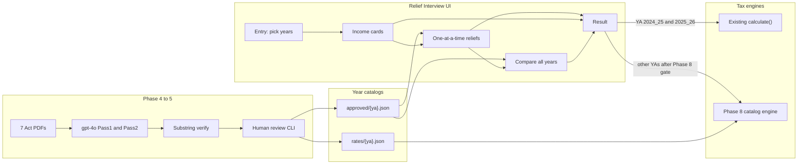

# Relief Interview — Implementation Plan

**Status:** Phases 0–8 delivered. Phase 8 catalog rate engine serves extracted `rates/{ya}.json` for `2018_19`–`2025_26`. `calculate()` remains the verified authority for `2024_25` / `2025_26`; Result also shows an additional unverified catalog estimate for those years. See [Phase 8 report](relief_interview_phase8_catalog_engine.md).
**Canonical doc:** this file. Do not treat chat history as the plan.
**Last amended:** 2026-08-22 (engine-year Result keeps calculate(); catalog estimate is an extra card)

---

## A. What I am building (plain language)

This project adds a new Adaptive Tax feature called **Relief Interview**. It sits next to the existing Calculator in the sidebar, but it does a different job.

**The research story I need to demonstrate:** Sri Lankan income-tax **reliefs and rates change across assessment years**. For example, personal relief is Rs 1.2M in YA 2024/25 and Rs 1.8M in YA 2025/26. The Calculator already computes tax for two years; Relief Interview makes those year-to-year legal differences **visible, explainable, and provenance-backed** — not just “the engine returned a different number.”

### What the user does

1. **Pick years** — choose an assessment year and a year to compare against (any pair in the supported range, not only 2024/25 vs 2025/26).
2. **Enter income** — same Employment / Business / Investment / Other Income fields as the Calculator (same cards, same catalog). This part is a form, not a chat.
3. **Answer relief questions one at a time** — e.g. “Did you incur solar panel expenditure? If so, how much?” Each question’s wording comes from a **verified catalog for that year**, not from a live LLM inventing text per request. Beside each question, the UI shows **how that relief differs from the compare year** (increased / decreased / unchanged / not available).
4. **Compare across all years** — pick one relief (e.g. personal relief, solar) and see its value across every supported YA in a table.
5. **See tax result** — for 2024/25 and 2025/26, the **verified** tax is still computed with the **existing** Adaptive Tax `calculate()` engine (Phase 7 viva pairwise unchanged). Result also shows an **additional** catalog estimate from extracted `approved/` + `rates/` JSON (all claimed reliefs, Act receipts). That catalog card is labeled as not independently verified against the official engine. For older years, tax remains catalog-only, with the same “extracted from source…” badge.

### What happens behind the scenes (the accuracy story)

```text
Act PDFs (7 statutes)
        │
        ▼
  gpt-4o Pass 1  →  structured reliefs + rates + quotes
        │
        ▼
  gpt-4o Pass 2  →  “is this quote verbatim?” (supporting check)
        │
        ▼
  Deterministic substring check against real PDF text  ← FINAL AUTHORITY
        │
        ▼
  Human review (approve / reject / flag)  — may NOT type numbers by hand
        │
        ▼
  approved/{ya}.json   +   rates/{ya}.json
  (immutable per year; every row has act_name, section_ref, quote, source_doc_id)
        │
        ▼
  Interview UI + Compare table + Result
```

**Centerpiece:** year-to-year relief comparison with a receipt (which Act, which section, which quote) — so a viva can see that the system is grounded in the real Inland Revenue Acts, not in hardcoded guesses.

---

## B. Goals and non-goals

### Goals

| Goal | Meaning |
|---|---|
| Demonstrate YA change | Same facts, different years → different reliefs/rates, explained in the UI |
| Provenance | Every catalog value traces to Pass 1 → Pass 2 → PDF substring match |
| Extractor-only numbers | No hand-typing caps/rates into `approved/` or `rates/` |
| Leave Calculator alone | Do not change existing Calculator behaviour |
| Minimal touch of existing code | Only narrow, additive exceptions (nav; optional one router line) |

### Non-goals

- Do **not** modify existing `calculate()` or its YA enum (`2024_25` / `2025_26` only).
- Do **not** extract from the Guide or ontology PDF; Consolidated 2025 is **check-only**, never a write source.
- Do **not** invent tax figures for older years until Phase 8 passes its accuracy gate.
- Do **not** silently rewrite past approved year files when a new Act arrives.

---

## C. End-to-end picture



**Supported assessment years (working hypothesis until Phase 1 confirms):**  
`2018_19` … `2025_26` (eight years), derived from Act commencement / Column III dates.

---

## D. Hard constraints (read before coding)

1. **Existing-file exceptions only**
   - **Required:** [frontend/src/features/adaptive-tax/index.tsx](../../frontend/src/features/adaptive-tax/index.tsx) — one nested route tree + one sidebar item “Relief Interview”.
   - **Optional:** one `include_router(...)` in [main.py](../../backend/comp-adaptive-tax/adaptive_tax_app/main.py) for new relief-interview endpoints.
   - Do **not** edit `calculator.tsx`, `rule_engine.py`, `routers/calculate.py`, AppShell, vite, gateway, ontology packs, etc. (full list in §J).

2. **Extractor-only catalog values**  
   Every number/formula in `approved/{ya}.json` and `rates/{ya}.json` must come from **Pass 1 → Pass 2 → substring verify**. Missing stays missing (or flagged). No hand-transcription of “known” values (1.2M, 1.8M, 600k, slabs). Ontology packs are **reference-only** for accuracy checks.

3. **Phase 1 YA-mapping stop**  
   If commencement harvest remaps the year range, **stop before Phases 2–7** until a human accepts the new mapping.

4. **PDF path authority = corpus_manifest**  
   Before any PDF open/parse (Phase 1 harvest, Phase 4 extract, Phase 6 watcher inputs already in corpus), resolve paths **only** from [models/adaptive-tax/corpus_manifest.json](../../models/adaptive-tax/corpus_manifest.json): look up each `source_doc_id` → its `file_name` → confirm that exact file exists under `data/raw/adaptive-tax/`. Fail loudly on missing or renamed files. **Do not assume filenames listed in this plan doc** — they are illustrative; the manifest is the authority. Do not silently rewrite `corpus_manifest.json`.

5. **Phase 8 gate**  
   Do not write the multi-year catalog engine until extracted `rates/2024_25` and `rates/2025_26` match the existing ontology rate packs.

6. **Provenance on every row**  
   Each relief and each rate band needs `act_name`, `section_ref`, `quote`, `source_doc_id` so the Phase 8 badge has a receipt to expand into.

---

## E. User-facing design

### E1. Navigation and pages

One sidebar entry under Adaptive Tax. In-flow pages (not five sidebar items):

| URL | Purpose |
|---|---|
| `/adaptive-tax/relief-interview` | Pick YA + compare year; start |
| `.../income` | Same income cards as Calculator |
| `.../reliefs` | Conversational one-question-at-a-time reliefs |
| `.../compare` | One relief’s value across **all** supported years |
| `.../result` | Tax outcome (+ provenance badges where needed) |

Exact additive edit: only [index.tsx](../../frontend/src/features/adaptive-tax/index.tsx) (imports + nested `relief-interview` routes + one `nav` item with `MessageCircle`). AppShell has no nested nav — do not edit it.

### E2. Income (non-conversational)

- Same 18 + 4 + 15 + 3 fields as Calculator (Employment, Business, Investment, Other Income).
- **Duplicate** the four section UIs into new files (they are private inside `calculator.tsx` and cannot be imported without editing that file).
- **Import** shared shells: `CatalogCardShell`, `CatalogFieldRow`, `getFilingCatalog`, `format-lkr`.
- Filing-catalog API only knows `2024_25` / `2025_26`; for older interview years reuse the same field list and show a limited-verification badge when needed.

### E3. Reliefs interview (centerpiece UX)

- One question at a time from `approved/{ya}.json` (`question_prompt`).
- Sticky **As of YA …** badge; **How this differs from [compare year]** panel on every question (Increased / Decreased / Unchanged / New / Not available / Limited verification), with quotes from both years’ catalogs.
- Order sketch: personal-relief notice (auto-applied) → solar → rent → Fifth Sch 1 QP categories → Sec 52(4) BF → Sec 89 APIT.
- Rows with `needs_manual_verification` stay visible with a badge — never silently treated as fully verified.

### E4. Compare and Result

- **Compare:** pick a `compare_group_id` (e.g. personal relief); table of that relief across every YA.
- **Result:**  
  - 2024/25 & 2025/26 → existing `calculate()` (authority).  
  - Other years → catalog-only until Phase 8; then new engine + expandable “extracted from source, not independently verified” badge (`act_name` / `section_ref` / `quote`).

### E5. Demo honesty (must stay in UI copy)

- Calculator’s “Sec 52 cap 1.2M/1.8M” labels are really **personal relief** amounts; live engine is Path B (no aggregate Sec 52 QP pool).
- Real YA-gated diffs to show: personal relief **1.2M vs 1.8M**; Sec 52(4) CF from **2025/26**; Fifth Sch 2(f) sunset before 2022/23; solar **600k from 2021/22** (unchanged thereafter where in force).
- Unchanged caps must still show as **Unchanged**.

---

## F. Data pipeline (Acts → catalogs)

### F1. Assessment-year range (Phase 1)

**Step 0 — confirm PDF paths (before any parse):**  
For each extraction `source_doc_id`, read `file_name` from [corpus_manifest.json](../../models/adaptive-tax/corpus_manifest.json) and assert `data/raw/adaptive-tax/{file_name}` exists. Report any mismatch and **stop** — do not fall back to plan-doc names or Desktop aliases. YA fields on the manifest stay incomplete; do **not** use them as the YA range authority.

Derive YAs from each Act’s own commencement / Column III “date of operation” (not from incomplete `corpus_manifest` YA fields).

| Instrument | source_doc_id | Stated operation (per-provision) | YA impact |
|---|---|---|---|
| IRA No. 24 of 2017 s.1 | `ird-ira-2017-base` | **1 April 2018** | First coherent YA: **2018/19** |
| Amend. No. 10 of 2021 | `ird-amend-2021-10` | Table A: **1 April 2021**; Table B mixed | Solar / Fifth Sch 2(g) → **2021/22** |
| Amend. No. 45 of 2022 | `ird-amend-2022-45` | Table A: **1 April 2022**; Table B: **1 Oct 2022** | **2022/23** |
| Amend. No. 4 of 2023 | `ird-amend-2023-04` | Column III mixed dates | Gold-standard table format |
| Amend. No. 14 of 2023 | `ird-amend-2023-14` | Deemed **1 April 2023** | **2023/24** (narrow scope) |
| Amend. No. 2 of 2025 | `ird-amend-2025-02` | Whole Act **1 April 2025** | Personal relief 1.8M → **2025/26** |
| Amend. No. 11 of 2026 | `ird-amend-2026-11` | Sec 52 / Fifth Sch **01.04.2025** | **2025/26**; YA 2026/27 out of scope |
| Consolidated 2025 | `ird-consolidated-2025` | Compilation from Apr 2018 | **Not extracted** — accuracy cross-check only |

**Working hypothesis:** YA **2018/19–2025/26** (`2018_19` … `2025_26`). Phase 1 must re-confirm; if the harvest remaps anything, **stop before Phases 2–7**.

### F2. Extraction corpus (Phase 4)

**Pass 1 / Pass 2 — 7 statutes only** (resolve `file_name` from the manifest at runtime; names below are a spot-check illustration, not path authority):

1. `ird-ira-2017-base`
2. `ird-amend-2021-10`
3. `ird-amend-2022-45`
4. `ird-amend-2023-04` (gold-standard for Column III / “principal enactment is amended”)
5. `ird-amend-2023-14`
6. `ird-amend-2025-02`
7. `ird-amend-2026-11`

**Never extract / never write into catalogs:** `ird-consolidated-2025`, `ird-guide-ira`, `ird-calc-ontology-v5`. Open files only via manifest `file_name` under `data/raw/adaptive-tax/` (Desktop names are aliases only).

**Sections per Act (empty focus → skip):** Sec 5, 6, 7, 8, 11, 16, 52, 89, First Schedule, Fifth Schedule.

**Model:** `gpt-4o`, temperature **0**. Standalone scripts (copy pattern from existing extractors; do not import `gpt_extract.py` / `pdf_extract.py` as a hard dependency).

**Same PDF pass pulls both:**

- Reliefs / deductions (caps, formulas, effective dates, quotes)
- Rates / rules (slabs, rates, surcharge, special formulas) — each with `act_name`, `section_ref`, `quote`

**Pass 2:** separate call per entry — “does this exact quote appear verbatim? yes/no + closest quote if no.” Supporting only.

**§4b deterministic gate (final authority):**

- `quote_ok_focus` — quote found in focus window  
- `quote_ok_full_doc` — quote found in **full** Act text for `source_doc_id` (required for inclusion)

Fail Pass 2 or fail substring → **exclude**. Never ship as a low-confidence guess.

**Cost envelope (accepted before Phase 4):** ~220–340 gpt-4o calls; ~$8–14 expected; budget **$40**. Accuracy check: **$0**.

### F3. Storage

```
models/adaptive-tax/relief-interview/
  approved/{ya}.json     # relief interview questions + caps
  rates/{ya}.json        # slabs / surcharges / special formulas
  proposed/              # amendment watcher output (not live)
  extracted/             # staging
```

Phase 1 creates **empty** skeletons only (`entries: []`). Live content arrives only via extract → verify → review promote.

Every `rates/{ya}.json` defaults to `needs_manual_verification: true` (substring proves the quote exists; a human still spot-checks that it is the right rate for that YA).

### F4. Accuracy check (hard gate before Phase 8)

Diff extracted `rates/2024_25.json` and `rates/2025_26.json` against:

1. Ontology packs `rate_bands_2024_25.json` (6 bands incl. 12%) and `rate_bands_2025_26.json` (5 bands, 6% on first 1M)  
2. Consolidated 2025 as **independent cross-check only** (do not copy its text into catalogs)

Ontology mismatch → **stop; do not write Phase 8**.

### F5. Human review (Phase 5)

CLI: `approve` / `reject` / `mark-needs-manual-verification`.  
May **copy** extractor rows only. May **not** type caps/rates from the PDF. Wrong/missing → re-run extract+verify.

### F6. Amendment watcher (Phase 6)

For PDFs **not** already in the manifest → `proposed/` → human sets future YA → new `approved/YYYY_YY.json`. Past year files stay immutable. Act 04/2023 is already in the extract corpus (not the watcher demo).

---

## G. Tax calculation

| Years | Engine | Notes |
|---|---|---|
| `2024_25`, `2025_26` | Existing `calculate(..., kg=default_file_kg())` | Authority; do not modify |
| Other YAs (after Phase 8 gate) | **New** module reading `rates/{ya}.json` | Additive; expandable provenance badge |
| Other YAs (before Phase 8) | No tax number | Catalog / compare only |

Recommended HTTP: new router under existing Adaptive Tax app on `:8005` (one `include_router` in `main.py`). Vite/gateway already proxy `/api/v1/adaptive-tax/**`.

---

## H. Data schemas (summary)

| Schema | Role |
|---|---|
| **CommencementRecord** | Phase 1 harvest: Act section → operation date → derived YAs |
| **ExtractedEntry** | Pass 1/2 output + `quote_ok_focus` / `quote_ok_full_doc` + provenance |
| **ApprovedEntry** | Frozen interview row in `approved/{ya}.json` |
| **RateYearFile** | `rates/{ya}.json`: bands/surcharges/special_formulas; each item has `act_name`, `section_ref`, `quote`, `source_doc_id` |
| **InterviewSession** | UI state across pages (`sessionStorage`) |
| **AmendmentDiff** | Watcher output; never applied to past years silently |

Full field lists: keep the detailed definitions previously in §5 of this doc’s history — `act_name` / `section_ref` / `quote` / `source_doc_id` are mandatory on every included relief and rate row; `quote_ok_full_doc: true` required for inclusion.

---

## I. Evaluation (what “done” looks like)

1. **Phase 1 mapping** — Column III tables recovered; range reported; stop if remapped.  
2. **Extractor-only** — every value in `approved/` / `rates/` has an extract run trail; no ontology-only or hand-typed rows.  
3. **Quote + attribution** — `quote_ok_full_doc` **and** correct `act_name` / `section_ref` / `source_doc_id` for the Act that owns the quote.  
4. **Viva pairwise** — same income; personal relief 1.2M vs 1.8M; Sec 52(4); solar unchanged; tax delta on engine years.  
5. **Viva full range** — Compare table across confirmed YAs.  
6. **Badge** — expandable receipt matches stored provenance.  
7. **Rate accuracy** — 2024/25 & 2025/26 match ontology packs (Phase 8 gate).  
8. **Immutability** — watcher does not rewrite past `approved/*.json`.

---

## J. Do not touch / open questions

**Do not modify:** `calculator.tsx`, `api.ts` (import only), admin pages, home/coverage/report, `app-shell.tsx`, `features/types.ts`, `rule_engine.py`, `routers/calculate.py`, `gpt_extract.py`, `pdf_extract.py`, filing catalog, ontology relief/rate packs (read-only check targets), provenance audit script, vite, gateway, `corpus_manifest.json` (no silent rewrite), `CLAUDE.md`, `PHASES_RUNBOOK.md`.

**Open questions (recommendations stand):**

1. Income: **duplicate** sections (**recommended**)  
2. HTTP: **new `:8005` router** (**recommended**)  
3. Review v1: **CLI** (**recommended**)  
4. Sidebar: **one parent + in-flow** (**recommended**)  
5. YA 2026/27: **exclude** (**recommended**)  
6. Older-year tax: **Phase 8 after accuracy gate** (**answered**)

---

## K. Phased build order

| Phase | What happens | Stop / gate |
|---|---|---|
| **0** | This plan | — |
| **1** | Confirm manifest `file_name` ↔ disk under `data/raw/adaptive-tax/` → commencement harvest → report YA mapping → **empty** `approved/` + `rates/` skeletons | Missing/mismatched PDF vs manifest → **stop**. If YA mapping differs from 2018/19–2025/26 hypothesis → **stop; do not start Phases 2–7** |
| **2** | Nav exception + layout + entry/income + duplicated income cards | Only after Phase 1 stop cleared |
| **3** | Reliefs interview + year-diff + Compare-all-years + result (engine years) | — |
| **4** | gpt-4o extract (7 Acts × 10 sections; reliefs + rates same sweep) + substring verify + accuracy check vs ontology (+ Consolidated cross-check) | Report accuracy result; **do not write Phase 8** until accepted |
| **5** | Review CLI — promote **extractor rows only** — *delivered*; ledger at `relief-interview/review/decisions.json`, year files hash-sealed | No hand-typed values |
| **6** | Amendment watcher for new PDFs — *delivered*; `proposed/` + immutability baseline; Act 04/2023 refused | Past years immutable |
| **7** | Evaluation + viva checklist — *delivered*; `scripts/relief_interview_phase7_eval.py` → PASS_WITH_GAPS (Sec 52(4) gap) | — |
| **8** | Catalog engine from `rates/{ya}.json` — *delivered*; engine-year Result keeps `calculate()` and adds an extra catalog card | Only after Phase 4 accuracy check accepted |

Do not start Phases 1–7 until this plan is reviewed.  
Do not start Phases 2–7 until Phase 1’s YA-mapping stop is cleared.  
Do not start Phase 8 until Phase 4’s rate accuracy check is reported and accepted.

---

## L. Quick reference — file map (when implementation starts)

| Area | New locations (illustrative) |
|---|---|
| UI | `frontend/src/features/adaptive-tax/pages/relief-interview/*`, `.../relief-interview/income-cards.tsx` |
| Nav exception | `frontend/src/features/adaptive-tax/index.tsx` only |
| Extract / verify / review | `scripts/relief_interview_*.py`, `models/adaptive-tax/prompts/*` |
| Catalogs | `models/adaptive-tax/relief-interview/approved/`, `rates/`, `proposed/`, `extracted/` |
| Optional API | new router file + one line in `main.py` |
| Phase 8 engine | new module only — not a patch to `rule_engine.py` |
